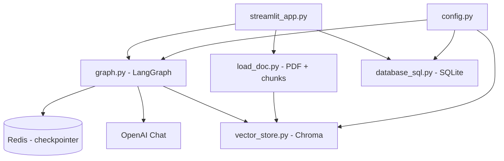

# RAG Semántico

Guía y aplicación de **RAG semántico de uso general**: indexa **cualquier PDF**, responde preguntas con recuperación aumentada y registra consultas sin respuesta útil para análisis posterior.


La interfaz es **Streamlit** (sin API REST). La memoria de conversación se persiste en **Redis** mediante el checkpointer de LangGraph.

---

## Características

- **Varias bases vectoriales**: crear, seleccionar y eliminar colecciones Chroma independientes desde la barra lateral.
- **Cualquier PDF**: al crear una base se sube un documento, se fragmenta con chunking semántico y se embebe con OpenAI.
- **Chat con streaming**: respuestas token a token en la UI.
- **Grafo LangGraph** con enrutamiento, reformulación de preguntas, recuperación con umbral de similitud, respuestas sin contexto y resumen de conversación.
- **Gaps de conocimiento**: preguntas fallidas se guardan en SQLite y se pueden exportar a Excel por base activa.
- **Memoria en Redis**: historial y resúmenes por `thread_id` (usuario de sistema).

---

## Arquitectura



### Flujo del grafo (LangGraph)

1. **Router** (`summary_request_router`): si el usuario pide un resumen → nodo `summary`; si no → `reformulate`.
2. **Reformulate**: convierte la última pregunta en una pregunta autosuficiente usando historial y resumen previo.
3. **Context**: búsqueda semántica en Chroma (`retrieve_with_score`, umbral de score &lt; 0.67).
4. **Chatbot** o **no_answer**: con contexto relevante genera respuesta; sin contexto devuelve el mensaje estándar de falta de información.
5. **Summarize** (opcional): tras ≥10 mensajes con respuesta válida, comprime memoria y elimina mensajes antiguos del estado.

---

## Estructura del proyecto

| Archivo | Rol |
|---------|-----|
| `streamlit_app.py` | UI: gestión de bases, chat, descarga de reporte de fallos |
| `graph.py` | Definición del grafo LangGraph y nodos |
| `config.py` | Rutas, modelos, cachés, Redis y SQLite |
| `vector_store.py` | Wrapper de Chroma (crear, cargar, búsqueda con score) |
| `load_doc.py` | Carga PDF, limpieza de texto y `SemanticChunker` |
| `database_sql.py` | Registro y exportación Excel de preguntas fallidas |
| `requirements.txt` | Dependencias Python |
| `arrancar_rag.bat` | Arranque en Windows (Docker Redis + venv + Streamlit en red) |

Carpetas generadas en runtime (ignoradas en git):

- `vector_stores/` — persistencia de cada base Chroma
- `db_folder/` — ruta legacy opcional (`DATABASE_DIRECTORY`)
- `gaps_conocimiento.db` — SQLite de preguntas sin respuesta
- `venv/` — entorno virtual

---

## Requisitos

- Python 3.10+ (recomendado)
- Cuenta y API key de **OpenAI** (embeddings + chat)
- **Docker** con Redis en `localhost:6379` (ver sección siguiente)
- Dependencias listadas en `requirements.txt`

---

## Redis con Docker

La app espera Redis en **host** `localhost`, **puerto** `6379` (configurado en `config.py`). El checkpointer de LangGraph usa la base de datos Redis `0`.

### Crear el contenedor (primera vez)

Si aún no tienes el contenedor `redis-stack`:

```bash
docker run -d \
  --name redis-stack \
  -p 6379:6379 \
  redis/redis-stack:latest
```

Comprueba que está en ejecución:

```bash
docker ps --filter name=redis-stack
```

Prueba la conexión (opcional):

```bash
docker exec -it redis-stack redis-cli ping
```

Debería responder `PONG`.

### Iniciar o reiniciar (uso habitual)

```bash
docker start redis-stack
```

Si el contenedor se detuvo por reinicio del equipo, vuelve a ejecutar `docker start redis-stack` antes de abrir Streamlit.

### Alternativa ligera (solo Redis, sin RedisInsight)

Si no necesitas la UI de Redis Stack:

```bash
docker run -d \
  --name redis-stack \
  -p 6379:6379 \
  redis:7-alpine
```

Usa el mismo nombre `redis-stack` para que coincida con `arrancar_rag.bat` y con los comentarios del proyecto.

### Problemas frecuentes

| Síntoma | Qué revisar |
|---------|-------------|
| Error al conectar a Redis | `docker ps`, que el puerto 6379 no esté ocupado por otro proceso |
| `Cannot connect to the Docker daemon` | Docker Desktop / servicio `docker` activo |
| Contenedor ya existe con otro nombre | `docker start <nombre>` o renombrar/recrer con `-p 6379:6379` |

---

## Instalación

### Linux / macOS

```bash
cd "RAG Semantico Rappi"   # o la ruta donde clonaste el repo
python -m venv venv
source venv/bin/activate
pip install -r requirements.txt
```

Crear `.env` en la raíz del proyecto (ver variables abajo).

Asegurar Redis en marcha (ver [Redis con Docker](#redis-con-docker)):

```bash
docker start redis-stack
```

Lanzar la app:

```bash
streamlit run streamlit_app.py
```

Para exponer en la red local:

```bash
streamlit run streamlit_app.py --server.address 0.0.0.0 --server.port 8501
```

### Windows

Ejecutar `arrancar_rag.bat`: intenta `docker start redis-stack`, crea/activa `venv`, instala dependencias si hace falta y abre Streamlit en `http://localhost:8501` (y en la IP local para otros equipos en la LAN).

Si el script falla en Redis, crea el contenedor una vez con el comando de la sección [Redis con Docker](#redis-con-docker) y vuelve a ejecutar el `.bat`.

---

## Variables de entorno

Crear un archivo `.env` en la raíz:

```env
OPENAI_API_KEY=sk-...

# Opcionales (valores por defecto entre paréntesis)
EMBEDDING_MODEL=text-embedding-ada-002
LLM_MODEL=gpt-4o-mini
LLM_TEMPERATURE=0
DATABASE_DIRECTORY=./db_folder
VECTOR_STORES_ROOT=vector_stores
SQLITE_NAME=gaps_conocimiento.db
```

Redis se configura en código (`localhost:6379`, DB 0) en `config.py`; no hay variables de entorno para Redis en la versión actual.

---

## Uso

1. Abrir la aplicación en el navegador.
2. En la barra lateral, **crear una base**: nombre válido (letras, números, `-`, `_`) + PDF obligatorio (cualquier contenido: manuales, políticas, informes, etc.).
3. Seleccionar la **base activa** para el chat.
4. Escribir preguntas; las respuestas usan solo el contexto recuperado del PDF indexado.
5. Si la respuesta no es válida (sin contexto o mensaje de “no tengo esa información”), la pregunta se registra en SQLite.
6. Descargar **reporte de fallos** (Excel) filtrado por la base activa cuando existan registros.

El `thread_id` de LangGraph se deriva del usuario del sistema (`sys_<usuario>`), de modo que cada usuario mantiene su propia conversación en Redis.

---

## Chunking e indexación

- **PyPDFLoader** para extraer páginas.
- Normalización de saltos de línea y espacios (útil en PDFs exportados desde editores con saltos irregulares).
- **RecursiveCharacterTextSplitter** previo (tamaño 1200, solapamiento 200, separadores por numeración de secciones).
- **SemanticChunker** (`langchain_experimental`) con embeddings OpenAI y umbral `percentile`.
- Chroma persiste con distancia **cosine** (`hnsw:space`).

---

## Stack tecnológico

| Componente | Tecnología |
|------------|------------|
| UI | Streamlit |
| Orquestación | LangGraph |
| LLM / embeddings | LangChain + OpenAI |
| Vector store | Chroma (`langchain-chroma`) |
| Checkpointer | `langgraph-checkpoint-redis` |
| Gaps | SQLite + pandas + xlsxwriter |

---

## Sugerencias de mejora

Ideas opcionales para evolucionar el proyecto (no implementadas hoy):

1. **`.env.example`** en el repo con todas las variables documentadas, sin secretos.
2. **Docker Compose** unificado (Redis + app) para Linux/macOS, alineado con `arrancar_rag.bat`.
3. **Variables de entorno para Redis** (`REDIS_HOST`, `REDIS_PORT`) en lugar de valores fijos en `config.py`.
4. **Reindexar / actualizar** una base existente (subir nuevo PDF sin borrar la colección).
5. **Panel de métricas**: conteo de gaps por base, usuario y fecha desde Streamlit.
6. **Umbral de similitud configurable** (hoy `0.67` está fijo en `graph.py`).
7. **Tests** mínimos para `sanitize_vector_db_name`, chunking y nodos del grafo con mocks.
8. **CI** con `pip install` + lint; evitar commitear `gaps_conocimiento.db` (ya en `.gitignore`).
9. **API REST** si se necesita integrar el RAG fuera de Streamlit.
10. **Autenticación** en Streamlit si la app se expone en red (`0.0.0.0`).
11. **Eliminar `print` de depuración** en `context_node` y usar logging estructurado.
12. **Soporte multi-formato** (DOCX, Markdown) además de PDF en `load_doc.py`.

---

## Licencia y contacto

No se define licencia en el repositorio. Añadir `LICENSE` y datos de contacto o mantenimiento si compartes el proyecto con terceros.
